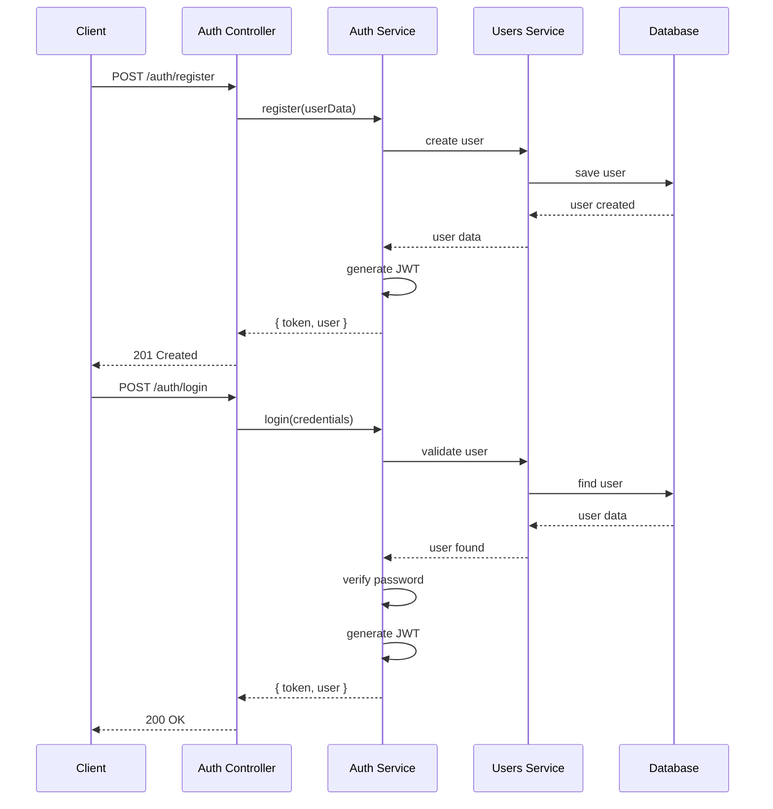

# 🔐 EcoRide Authentication System

## Overview

EcoRide uses a comprehensive JWT-based authentication system with role-based access control. The system provides secure user registration, login, and protected route access.

## Authentication Flow



## Features

### 🔐 Secure Authentication
- **JWT Tokens**: Stateless authentication with configurable expiration
- **Password Hashing**: bcrypt with salt rounds for secure password storage
- **Credential Validation**: Email format and password strength validation
- **Account Status**: Active/inactive user management

### 👥 Role-Based Access Control
- **User Roles**: `VISITOR`, `USER`, `EMPLOYEE`, `ADMINISTRATOR`
- **User Types**: `PASSENGER`, `DRIVER`, `BOTH`
- **Permission Matrix**: Fine-grained access control per endpoint

### 🛡️ Security Guards
- **JWT Guard**: Protects authenticated routes
- **Role Guard**: Enforces role-based permissions
- **Local Guard**: Handles login credential validation

## User Roles & Permissions

### Role Hierarchy

| Role | Level | Description | Default Permissions |
|------|-------|-------------|-------------------|
| `VISITOR` | 0 | Unregistered user | Read-only access to public data |
| `USER` | 1 | Registered user | Full user operations, booking, reviews |
| `EMPLOYEE` | 2 | EcoRide staff | User management, moderate reviews |
| `ADMINISTRATOR` | 3 | System admin | Full system access, user management |

### User Types

| Type | Description | Capabilities |
|------|-------------|--------------|
| `PASSENGER` | Books trips | Create bookings, submit reviews |
| `DRIVER` | Offers trips | Create trips, manage bookings |
| `BOTH` | Hybrid user | All capabilities |

## Implementation

### Authentication Module Structure

```typescript
// auth.module.ts
@Module({
  imports: [
    UsersModule,
    PassportModule,
    JwtModule.registerAsync({
      imports: [ConfigModule],
      useFactory: async (configService: ConfigService) => ({
        secret: configService.get<string>('JWT_SECRET'),
        signOptions: { expiresIn: '24h' },
      }),
      inject: [ConfigService],
    }),
  ],
  providers: [AuthService, LocalStrategy, JwtStrategy],
  controllers: [AuthController],
  exports: [AuthService],
})
export class AuthModule {}
```

### JWT Strategy

```typescript
// jwt.strategy.ts
@Injectable()
export class JwtStrategy extends PassportStrategy(Strategy) {
  constructor(private configService: ConfigService) {
    super({
      jwtFromRequest: ExtractJwt.fromAuthHeaderAsBearerToken(),
      ignoreExpiration: false,
      secretOrKey: configService.get<string>('JWT_SECRET'),
    });
  }

  async validate(payload: JwtPayload): Promise<UserWithoutPassword> {
    return {
      id: payload.sub,
      email: payload.email,
      pseudo: payload.pseudo,
      role: payload.role,
      userType: payload.userType,
    };
  }
}
```

### Auth Service

```typescript
// auth.service.ts
@Injectable()
export class AuthService {
  constructor(
    private usersService: UsersService,
    private jwtService: JwtService,
  ) {}

  async register(createUserDto: CreateUserDto): Promise<AuthResponseDto> {
    // Check if user exists
    const existingUser = await this.usersService.findByEmail(createUserDto.email);
    if (existingUser) {
      throw new ConflictException('User with this email already exists');
    }

    // Hash password
    const hashedPassword = await bcrypt.hash(createUserDto.password, 12);
    
    // Create user
    const user = await this.usersService.create({
      ...createUserDto,
      password: hashedPassword,
    });

    // Generate token
    const token = this.generateToken(user);
    
    return {
      access_token: token,
      user: this.excludePassword(user),
    };
  }

  async login(user: User): Promise<AuthResponseDto> {
    const token = this.generateToken(user);
    return {
      access_token: token,
      user: this.excludePassword(user),
    };
  }

  private generateToken(user: User): string {
    const payload: JwtPayload = {
      sub: user.id,
      email: user.email,
      pseudo: user.pseudo,
      role: user.role,
      userType: user.userType,
    };
    return this.jwtService.sign(payload);
  }
}
```

## API Endpoints

### POST /auth/register

Register a new user account.

**Request:**
```json
{
  "firstname": "John",
  "lastname": "Doe",
  "email": "john.doe@example.com",
  "password": "SecurePass123!",
  "pseudo": "johndoe"
}
```

**Response:**
```json
{
  "access_token": "eyJhbGciOiJIUzI1NiIsInR5cCI6IkpXVCJ9...",
  "user": {
    "id": 1,
    "email": "john.doe@example.com",
    "pseudo": "johndoe",
    "firstname": "John",
    "lastname": "Doe",
    "role": "USER",
    "userType": "PASSENGER",
    "credits": 20,
    "isActive": true
  }
}
```

**Validation Rules:**
- Email must be valid format
- Password must be at least 8 characters
- Password must contain uppercase, lowercase, number, and special character
- Pseudo must be unique
- All fields are required

### POST /auth/login

Authenticate user with email and password.

**Request:**
```json
{
  "email": "john.doe@example.com",
  "password": "SecurePass123!"
}
```

**Response:** Same as registration

**Error Responses:**
- `401 Unauthorized`: Invalid credentials
- `403 Forbidden`: Account inactive

## Guards Usage

### Protecting Routes

```typescript
// Require authentication
@UseGuards(JwtAuthGuard)
@Get('profile')
async getProfile(@Request() req) {
  return req.user;
}

// Require specific role
@UseGuards(JwtAuthGuard, RolesGuard)
@Roles('ADMINISTRATOR')
@Delete('users/:id')
async deleteUser(@Param('id') id: number) {
  // Only administrators can delete users
}

// Public route (no guards)
@Get('public')
async getPublicData() {
  return { message: 'This is public data' };
}
```

### Custom Guards

```typescript
// roles.guard.ts
@Injectable()
export class RolesGuard implements CanActivate {
  constructor(private reflector: Reflector) {}

  canActivate(context: ExecutionContext): boolean {
    const requiredRoles = this.reflector.getAllAndOverride<UserRole[]>(
      ROLES_KEY,
      [context.getHandler(), context.getClass()],
    );
    
    if (!requiredRoles) {
      return true;
    }

    const { user } = context.switchToHttp().getRequest();
    return requiredRoles.some((role) => user.role === role);
  }
}
```

## Security Configuration

### Environment Variables

```env
# JWT Configuration
JWT_SECRET=your_super_secure_jwt_secret_key_here
JWT_EXPIRATION=24h

# Password Security
BCRYPT_ROUNDS=12

# Rate Limiting
AUTH_RATE_LIMIT=5
AUTH_RATE_WINDOW=60000
```

### Password Security Requirements

- **Minimum Length**: 8 characters
- **Complexity**: Must contain:
  - At least one uppercase letter (A-Z)
  - At least one lowercase letter (a-z)  
  - At least one number (0-9)
  - At least one special character (!@#$%^&*)
- **Hashing**: bcrypt with 12 salt rounds

### JWT Token Security

- **Algorithm**: HS256 (HMAC with SHA-256)
- **Expiration**: 24 hours (configurable)
- **Claims**: user ID, email, pseudo, role, userType
- **Secret**: Environment-based secret key

## Testing Authentication

### Manual Testing Script

```bash
#!/bin/bash
# test-auth.sh

echo "Testing EcoRide Authentication System"

# Test Registration
echo "1. Testing user registration..."
REGISTER_RESPONSE=$(curl -s -X POST http://localhost:3000/auth/register \
  -H "Content-Type: application/json" \
  -d '{
    "firstname": "John",
    "lastname": "Doe", 
    "email": "john.doe@example.com",
    "password": "SecurePass123!",
    "pseudo": "johndoe"
  }')

echo "Registration Response: $REGISTER_RESPONSE"

# Extract token
TOKEN=$(echo $REGISTER_RESPONSE | jq -r '.access_token')

# Test Login
echo "2. Testing user login..."
LOGIN_RESPONSE=$(curl -s -X POST http://localhost:3000/auth/login \
  -H "Content-Type: application/json" \
  -d '{
    "email": "john.doe@example.com",
    "password": "SecurePass123!"
  }')

echo "Login Response: $LOGIN_RESPONSE"

# Test Protected Route
echo "3. Testing protected route..."
PROFILE_RESPONSE=$(curl -s -X GET http://localhost:3000/users/profile \
  -H "Authorization: Bearer $TOKEN")

echo "Profile Response: $PROFILE_RESPONSE"
```

### Unit Tests

```typescript
// auth.service.spec.ts
describe('AuthService', () => {
  let service: AuthService;
  let usersService: UsersService;
  let jwtService: JwtService;

  beforeEach(async () => {
    const module: TestingModule = await Test.createTestingModule({
      providers: [
        AuthService,
        {
          provide: UsersService,
          useValue: mockUsersService,
        },
        {
          provide: JwtService,
          useValue: mockJwtService,
        },
      ],
    }).compile();

    service = module.get<AuthService>(AuthService);
  });

  describe('register', () => {
    it('should register a new user', async () => {
      const createUserDto = {
        email: 'test@example.com',
        password: 'SecurePass123!',
        firstname: 'John',
        lastname: 'Doe',
        pseudo: 'johndoe',
      };

      const result = await service.register(createUserDto);

      expect(result).toHaveProperty('access_token');
      expect(result).toHaveProperty('user');
      expect(result.user).not.toHaveProperty('password');
    });

    it('should throw ConflictException for existing email', async () => {
      mockUsersService.findByEmail.mockResolvedValue({ id: 1 });

      await expect(service.register(createUserDto))
        .rejects
        .toThrow(ConflictException);
    });
  });
});
```

## Error Handling

### Common Authentication Errors

| Error | Status | Description | Solution |
|-------|--------|-------------|----------|
| Invalid credentials | 401 | Wrong email/password | Check credentials |
| User already exists | 409 | Email already registered | Use different email |
| Invalid token | 401 | JWT token expired/invalid | Re-authenticate |
| Account inactive | 403 | User account disabled | Contact administrator |
| Insufficient permissions | 403 | Role/permission denied | Check user role |

### Error Response Format

```json
{
  "statusCode": 401,
  "message": "Invalid credentials",
  "error": "Unauthorized",
  "timestamp": "2024-01-15T10:30:00.000Z",
  "path": "/auth/login"
}
```

## Best Practices

### 🔐 Security Best Practices

1. **Never log passwords** - Even in development
2. **Use HTTPS** - Always in production
3. **Rotate JWT secrets** - Regularly update secrets
4. **Implement rate limiting** - Prevent brute force attacks
5. **Validate all inputs** - Use DTOs and pipes
6. **Handle errors securely** - Don't leak sensitive information

### 📱 Client Integration

1. **Store tokens securely** - Use secure storage mechanisms
2. **Handle token expiration** - Implement refresh logic
3. **Clear tokens on logout** - Remove from storage
4. **Include error handling** - Handle authentication failures gracefully

### 🔄 Token Management

1. **Short expiration times** - Balance security and UX
2. **Implement refresh tokens** - For long-lived sessions
3. **Blacklist revoked tokens** - Track invalidated tokens
4. **Monitor token usage** - Log authentication events

## Migration from Legacy Systems

If migrating from an existing authentication system:

1. **Password Migration**: Hash existing passwords with bcrypt
2. **Role Mapping**: Map old roles to new role system
3. **Token Migration**: Invalidate old tokens, issue new JWTs
4. **User Data**: Migrate user profiles and preferences
5. **Session Cleanup**: Clear old session data

## Troubleshooting

### Common Issues

1. **JWT_SECRET not set**: Ensure environment variable is configured
2. **Database connection**: Verify database connectivity
3. **Password validation**: Check password complexity requirements
4. **CORS issues**: Configure CORS for frontend domain
5. **Token expiration**: Implement proper token refresh logic

### Debug Mode

Enable authentication debugging in development:

```typescript
// Enable in auth.module.ts
JwtModule.register({
  secret: process.env.JWT_SECRET,
  signOptions: { 
    expiresIn: '24h',
    issuer: 'ecoride-api',
    audience: 'ecoride-client'
  },
  verifyOptions: {
    issuer: 'ecoride-api',
    audience: 'ecoride-client'
  }
})
```

This comprehensive authentication system provides secure, scalable user management for the EcoRide platform while maintaining flexibility for future enhancements.
