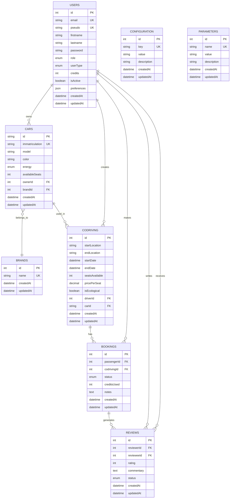

# 🗄️ EcoRide Database Schema

## Overview

EcoRide uses MySQL 8.x with TypeORM as the Object-Relational Mapping (ORM) framework. The database design follows relational database principles with proper normalization and foreign key relationships.

## Database Architecture



## Entity Definitions

### Users Entity

The core entity managing user accounts and authentication.

```sql
CREATE TABLE `users` (
  `id` int NOT NULL AUTO_INCREMENT,
  `email` varchar(255) NOT NULL,
  `pseudo` varchar(255) NOT NULL,
  `firstname` varchar(255) NOT NULL,
  `lastname` varchar(255) NOT NULL,
  `password` varchar(255) NOT NULL,
  `role` enum('VISITOR','USER','EMPLOYEE','ADMINISTRATOR') NOT NULL DEFAULT 'USER',
  `userType` enum('PASSENGER','DRIVER','BOTH') NOT NULL DEFAULT 'PASSENGER',
  `credits` int NOT NULL DEFAULT '20',
  `isActive` tinyint NOT NULL DEFAULT '1',
  `preferences` json DEFAULT NULL,
  `createdAt` datetime(6) NOT NULL DEFAULT CURRENT_TIMESTAMP(6),
  `updatedAt` datetime(6) NOT NULL DEFAULT CURRENT_TIMESTAMP(6) ON UPDATE CURRENT_TIMESTAMP(6),
  PRIMARY KEY (`id`),
  UNIQUE KEY `IDX_email` (`email`),
  UNIQUE KEY `IDX_pseudo` (`pseudo`)
);
```

**TypeScript Entity:**
```typescript
@Entity('users')
export class User {
  @PrimaryGeneratedColumn()
  id: number;

  @Column({ unique: true })
  email: string;

  @Column({ unique: true })
  pseudo: string;

  @Column()
  firstname: string;

  @Column()
  lastname: string;

  @Column()
  password: string;

  @Column({
    type: 'enum',
    enum: UserRole,
    default: UserRole.USER,
  })
  role: UserRole;

  @Column({
    type: 'enum',
    enum: UserType,
    default: UserType.PASSENGER,
  })
  userType: UserType;

  @Column({ type: 'int', default: 20 })
  credits: number;

  @Column({ type: 'boolean', default: true })
  isActive: boolean;

  @Column({ type: 'json', nullable: true })
  preferences: UserPreferences | null;

  @OneToMany('Car', 'owner')
  cars: Car[];

  @CreateDateColumn()
  createdAt: Date;

  @UpdateDateColumn()
  updatedAt: Date;
}
```

### Cars Entity

Manages vehicle information and ownership.

```sql
CREATE TABLE `cars` (
  `id` varchar(255) NOT NULL,
  `immatriculation` varchar(255) NOT NULL,
  `model` varchar(255) NOT NULL,
  `color` varchar(255) NOT NULL,
  `energy` enum('Electric','Hybrid','Gasoline','Diesel') NOT NULL,
  `availableSeats` int NOT NULL DEFAULT '4',
  `ownerId` int NOT NULL,
  `brandId` int NOT NULL,
  `createdAt` datetime(6) NOT NULL DEFAULT CURRENT_TIMESTAMP(6),
  `updatedAt` datetime(6) NOT NULL DEFAULT CURRENT_TIMESTAMP(6) ON UPDATE CURRENT_TIMESTAMP(6),
  PRIMARY KEY (`id`),
  UNIQUE KEY `IDX_immatriculation` (`immatriculation`),
  KEY `FK_cars_owner` (`ownerId`),
  KEY `FK_cars_brand` (`brandId`),
  CONSTRAINT `FK_cars_owner` FOREIGN KEY (`ownerId`) REFERENCES `users` (`id`),
  CONSTRAINT `FK_cars_brand` FOREIGN KEY (`brandId`) REFERENCES `brands` (`id`)
);
```

### Brands Entity

Vehicle brand management.

```sql
CREATE TABLE `brands` (
  `id` int NOT NULL AUTO_INCREMENT,
  `name` varchar(255) NOT NULL,
  `createdAt` datetime(6) NOT NULL DEFAULT CURRENT_TIMESTAMP(6),
  `updatedAt` datetime(6) NOT NULL DEFAULT CURRENT_TIMESTAMP(6) ON UPDATE CURRENT_TIMESTAMP(6),
  PRIMARY KEY (`id`),
  UNIQUE KEY `IDX_name` (`name`)
);
```

### Codriving Entity

Trip/journey management for carpooling.

```sql
CREATE TABLE `codriving` (
  `id` int NOT NULL AUTO_INCREMENT,
  `startLocation` varchar(255) NOT NULL,
  `endLocation` varchar(255) NOT NULL,
  `startDate` datetime NOT NULL,
  `endDate` datetime NOT NULL,
  `seatsAvailable` int NOT NULL,
  `pricePerSeat` decimal(10,2) NOT NULL,
  `isEcological` tinyint NOT NULL DEFAULT '0',
  `driverId` int NOT NULL,
  `carId` varchar(255) NOT NULL,
  `createdAt` datetime(6) NOT NULL DEFAULT CURRENT_TIMESTAMP(6),
  `updatedAt` datetime(6) NOT NULL DEFAULT CURRENT_TIMESTAMP(6) ON UPDATE CURRENT_TIMESTAMP(6),
  PRIMARY KEY (`id`),
  KEY `FK_codriving_driver` (`driverId`),
  KEY `FK_codriving_car` (`carId`),
  CONSTRAINT `FK_codriving_driver` FOREIGN KEY (`driverId`) REFERENCES `users` (`id`),
  CONSTRAINT `FK_codriving_car` FOREIGN KEY (`carId`) REFERENCES `cars` (`id`)
);
```

### Bookings Entity

Trip booking and reservation management.

```sql
CREATE TABLE `bookings` (
  `id` int NOT NULL AUTO_INCREMENT,
  `passengerId` int NOT NULL,
  `codrivingId` int NOT NULL,
  `status` enum('PENDING','CONFIRMED','CANCELLED','COMPLETED') NOT NULL DEFAULT 'PENDING',
  `creditsUsed` int NOT NULL,
  `notes` text,
  `createdAt` datetime(6) NOT NULL DEFAULT CURRENT_TIMESTAMP(6),
  `updatedAt` datetime(6) NOT NULL DEFAULT CURRENT_TIMESTAMP(6) ON UPDATE CURRENT_TIMESTAMP(6),
  PRIMARY KEY (`id`),
  KEY `FK_bookings_passenger` (`passengerId`),
  KEY `FK_bookings_codriving` (`codrivingId`),
  CONSTRAINT `FK_bookings_passenger` FOREIGN KEY (`passengerId`) REFERENCES `users` (`id`),
  CONSTRAINT `FK_bookings_codriving` FOREIGN KEY (`codrivingId`) REFERENCES `codriving` (`id`)
);
```

### Reviews Entity

User rating and review system.

```sql
CREATE TABLE `reviews` (
  `id` int NOT NULL AUTO_INCREMENT,
  `reviewerId` int NOT NULL,
  `revieweeId` int NOT NULL,
  `rating` int NOT NULL,
  `commentary` text,
  `status` enum('PENDING','PUBLISHED','REJECTED') NOT NULL DEFAULT 'PENDING',
  `createdAt` datetime(6) NOT NULL DEFAULT CURRENT_TIMESTAMP(6),
  `updatedAt` datetime(6) NOT NULL DEFAULT CURRENT_TIMESTAMP(6) ON UPDATE CURRENT_TIMESTAMP(6),
  PRIMARY KEY (`id`),
  KEY `FK_reviews_reviewer` (`reviewerId`),
  KEY `FK_reviews_reviewee` (`revieweeId`),
  CONSTRAINT `FK_reviews_reviewer` FOREIGN KEY (`reviewerId`) REFERENCES `users` (`id`),
  CONSTRAINT `FK_reviews_reviewee` FOREIGN KEY (`revieweeId`) REFERENCES `users` (`id`),
  CONSTRAINT `CHK_rating_range` CHECK ((`rating` >= 1) AND (`rating` <= 5))
);
```

## Data Types and Enumerations

### User Role Enum
```typescript
export enum UserRole {
  VISITOR = 'VISITOR',
  USER = 'USER',
  EMPLOYEE = 'EMPLOYEE',
  ADMINISTRATOR = 'ADMINISTRATOR',
}
```

### User Type Enum
```typescript
export enum UserType {
  PASSENGER = 'PASSENGER',
  DRIVER = 'DRIVER',
  BOTH = 'BOTH',
}
```

### Car Energy Type
```typescript
export type CarEnergyType = 'Electric' | 'Hybrid' | 'Gasoline' | 'Diesel';
```

### Booking Status Enum
```typescript
export enum BookingStatus {
  PENDING = 'PENDING',
  CONFIRMED = 'CONFIRMED',
  CANCELLED = 'CANCELLED',
  COMPLETED = 'COMPLETED',
}
```

### Review Status Enum
```typescript
export enum ReviewStatus {
  PENDING = 'PENDING',
  PUBLISHED = 'PUBLISHED',
  REJECTED = 'REJECTED',
}
```

### User Preferences Interface
```typescript
export interface UserPreferences {
  smokingAllowed: boolean;
  animalsAllowed: boolean;
  musicAllowed: boolean;
}
```

## Relationships

### One-to-Many Relationships

1. **User → Cars**: One user can own multiple cars
2. **User → Codriving**: One user can create multiple trips as driver
3. **User → Bookings**: One user can make multiple bookings as passenger
4. **User → Reviews (as reviewer)**: One user can write multiple reviews
5. **User → Reviews (as reviewee)**: One user can receive multiple reviews
6. **Brand → Cars**: One brand can have multiple car models
7. **Codriving → Bookings**: One trip can have multiple bookings

### Many-to-One Relationships

1. **Cars → User**: Each car belongs to one owner
2. **Cars → Brand**: Each car belongs to one brand
3. **Codriving → User**: Each trip has one driver
4. **Codriving → Car**: Each trip uses one specific car
5. **Bookings → User**: Each booking belongs to one passenger
6. **Bookings → Codriving**: Each booking is for one specific trip
7. **Reviews → User (reviewer)**: Each review is written by one user
8. **Reviews → User (reviewee)**: Each review is about one user

## Indexes and Performance

### Primary Indexes
- All tables have primary key indexes (clustered)

### Unique Indexes
- `users.email` - Unique email addresses
- `users.pseudo` - Unique usernames
- `cars.immatriculation` - Unique license plates
- `brands.name` - Unique brand names

### Foreign Key Indexes
- Automatic indexes on all foreign key columns for join performance

### Custom Indexes
```sql
-- Search optimization
CREATE INDEX `IDX_codriving_locations` ON `codriving` (`startLocation`, `endLocation`);
CREATE INDEX `IDX_codriving_date` ON `codriving` (`startDate`);
CREATE INDEX `IDX_codriving_ecological` ON `codriving` (`isEcological`);
CREATE INDEX `IDX_bookings_status` ON `bookings` (`status`);
CREATE INDEX `IDX_reviews_rating` ON `reviews` (`rating`);

-- User search optimization
CREATE INDEX `IDX_users_active` ON `users` (`isActive`);
CREATE INDEX `IDX_users_role` ON `users` (`role`);
```

## Database Configuration

### Connection Settings

```typescript
// database.providers.ts
export const databaseProviders = [
  {
    provide: 'DATA_SOURCE',
    useFactory: async (): Promise<DataSource> => {
      const dataSource = new DataSource({
        type: 'mysql',
        host: process.env.DB_HOST || 'localhost',
        port: parseInt(process.env.DB_PORT) || 3306,
        username: process.env.DB_USERNAME || 'ecoride_app',
        password: process.env.DB_PASSWORD,
        database: process.env.DB_DATABASE || 'ecoride',
        entities: [__dirname + '/../**/*.entity{.ts,.js}'],
        synchronize: process.env.NODE_ENV !== 'production',
        logging: process.env.NODE_ENV === 'development',
        charset: 'utf8mb4',
        timezone: 'Z',
      });

      return dataSource.initialize();
    },
  },
];
```

### Environment Variables

```env
# Database Configuration
DB_HOST=localhost
DB_PORT=3306
DB_USERNAME=ecoride_app
DB_PASSWORD=your_secure_password
DB_DATABASE=ecoride

# Connection Pool
DB_CONNECTION_LIMIT=10
DB_ACQUIRECONNECTIONTIMEOUT=60000
DB_TIMEOUT=60000
```

## Security Implementation

### Database User Security

```sql
-- Create dedicated application user
CREATE USER 'ecoride_app'@'localhost' IDENTIFIED BY 'secure_password';

-- Grant minimal required permissions
GRANT SELECT, INSERT, UPDATE, DELETE ON ecoride.* TO 'ecoride_app'@'localhost';
GRANT CREATE, ALTER, DROP, INDEX, REFERENCES ON ecoride.* TO 'ecoride_app'@'localhost';

-- Flush privileges
FLUSH PRIVILEGES;
```

### Data Validation

1. **Email Validation**: Valid email format required
2. **Password Security**: Hashed with bcrypt (12 rounds)
3. **Rating Constraints**: 1-5 star rating validation
4. **Enum Validation**: Strict enum value enforcement
5. **Required Fields**: NOT NULL constraints on essential fields

### Audit Trail

```sql
-- Add audit columns to sensitive tables
ALTER TABLE users ADD COLUMN lastLoginAt DATETIME NULL;
ALTER TABLE bookings ADD COLUMN confirmedAt DATETIME NULL;
ALTER TABLE reviews ADD COLUMN moderatedAt DATETIME NULL;
```

## Migration Scripts

### Initial Database Setup

```sql
-- Create database
CREATE DATABASE ecoride CHARACTER SET utf8mb4 COLLATE utf8mb4_unicode_ci;

-- Use database
USE ecoride;

-- Create tables (in dependency order)
SOURCE migrations/001_create_users_table.sql;
SOURCE migrations/002_create_brands_table.sql;
SOURCE migrations/003_create_cars_table.sql;
SOURCE migrations/004_create_codriving_table.sql;
SOURCE migrations/005_create_bookings_table.sql;
SOURCE migrations/006_create_reviews_table.sql;
SOURCE migrations/007_create_configuration_table.sql;
SOURCE migrations/008_create_parameters_table.sql;

-- Insert default data
SOURCE seeds/001_default_brands.sql;
SOURCE seeds/002_default_configuration.sql;
```

### Sample Data Seeds

```sql
-- Default car brands
INSERT INTO brands (name) VALUES 
('Tesla'), ('BMW'), ('Volkswagen'), ('Renault'), 
('Peugeot'), ('Citroën'), ('Toyota'), ('Honda');

-- Default system configuration
INSERT INTO configuration (key, value, description) VALUES
('DEFAULT_USER_CREDITS', '20', 'Credits given to new users'),
('MAX_SEATS_PER_CAR', '8', 'Maximum seats allowed per vehicle'),
('MIN_TRIP_PRICE', '1', 'Minimum price per seat'),
('MAX_TRIP_PRICE', '100', 'Maximum price per seat');

-- Sample users (development only)
INSERT INTO users (email, pseudo, firstname, lastname, password, role, userType) VALUES
('admin@ecoride.com', 'admin', 'Admin', 'User', '$2b$12$hashedpassword', 'ADMINISTRATOR', 'BOTH'),
('driver@ecoride.com', 'driver1', 'John', 'Driver', '$2b$12$hashedpassword', 'USER', 'DRIVER'),
('passenger@ecoride.com', 'passenger1', 'Jane', 'Passenger', '$2b$12$hashedpassword', 'USER', 'PASSENGER');
```

## Performance Optimization

### Query Optimization

1. **Use Indexes**: Proper indexing for frequent queries
2. **Limit Results**: Pagination for large datasets
3. **Select Specific Fields**: Avoid SELECT *
4. **Join Optimization**: Efficient relationship loading
5. **Query Caching**: Redis for frequent queries

### Connection Pooling

```typescript
// Optimized connection pool settings
{
  type: 'mysql',
  host: process.env.DB_HOST,
  port: parseInt(process.env.DB_PORT) || 3306,
  username: process.env.DB_USERNAME,
  password: process.env.DB_PASSWORD,
  database: process.env.DB_DATABASE,
  extra: {
    connectionLimit: 10,
    acquireConnectionTimeout: 60000,
    timeout: 60000,
    reconnect: true,
  },
}
```

## Backup and Recovery

### Automated Backup Script

```bash
#!/bin/bash
# backup-database.sh

BACKUP_DIR="/var/backups/ecoride"
DATE=$(date +%Y%m%d_%H%M%S)
BACKUP_FILE="ecoride_backup_${DATE}.sql"

# Create backup directory
mkdir -p $BACKUP_DIR

# Perform backup
mysqldump -u ecoride_app -p ecoride > $BACKUP_DIR/$BACKUP_FILE

# Compress backup
gzip $BACKUP_DIR/$BACKUP_FILE

# Remove backups older than 30 days
find $BACKUP_DIR -name "*.sql.gz" -mtime +30 -delete

echo "Backup completed: $BACKUP_DIR/${BACKUP_FILE}.gz"
```

### Recovery Process

```bash
#!/bin/bash
# restore-database.sh

BACKUP_FILE=$1

if [ -z "$BACKUP_FILE" ]; then
    echo "Usage: $0 <backup_file.sql.gz>"
    exit 1
fi

# Extract backup
gunzip $BACKUP_FILE

# Restore database
mysql -u ecoride_app -p ecoride < ${BACKUP_FILE%.gz}

echo "Database restored from $BACKUP_FILE"
```

## Monitoring and Maintenance

### Database Health Checks

```sql
-- Check table sizes
SELECT 
    TABLE_NAME as 'Table',
    ROUND(((DATA_LENGTH + INDEX_LENGTH) / 1024 / 1024), 2) as 'Size (MB)'
FROM information_schema.TABLES 
WHERE TABLE_SCHEMA = 'ecoride'
ORDER BY (DATA_LENGTH + INDEX_LENGTH) DESC;

-- Check connection status
SHOW PROCESSLIST;

-- Check slow queries
SELECT * FROM mysql.slow_log ORDER BY start_time DESC LIMIT 10;
```

### Maintenance Tasks

1. **Regular ANALYZE**: Update table statistics
2. **Index Maintenance**: Check for unused indexes
3. **Log Rotation**: Manage MySQL logs
4. **Performance Monitoring**: Track query performance
5. **Security Audits**: Regular permission reviews

This comprehensive database schema provides a solid foundation for the EcoRide carpooling platform with proper relationships, security, and performance optimization.
