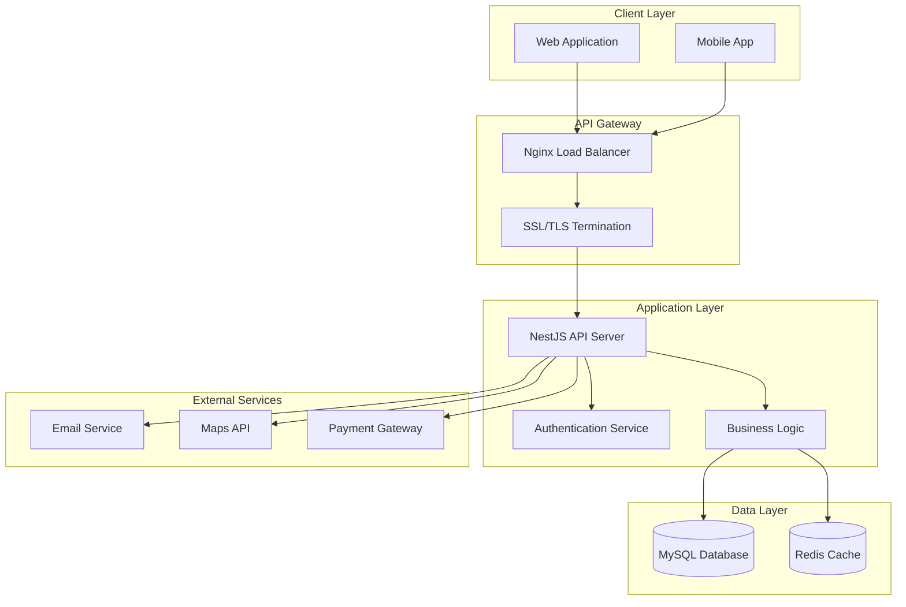

# 📚 EcoRide Documentation Index

## 🎯 Documentation Overview

Welcome to the complete EcoRide API documentation. This comprehensive documentation set covers all aspects of the carpooling platform from setup to deployment.

## 📖 Documentation Structure

### Core Documentation

| Document | Description | Audience |
|----------|-------------|----------|
| [README.md](../README.md) | Main project overview and quick start | All users |
| [API.md](./API.md) | Complete API reference and endpoints | Developers, Integrators |
| [AUTHENTICATION.md](./AUTHENTICATION.md) | Authentication system guide | Developers, Security |
| [DATABASE.md](./DATABASE.md) | Database schema and relationships | Developers, DBAs |
| [SETUP.md](./SETUP.md) | Installation and configuration | DevOps, Developers |
| [DEVELOPMENT.md](./DEVELOPMENT.md) | Development guidelines and workflow | Developers |
| [DEPLOYMENT.md](./DEPLOYMENT.md) | Production deployment guide | DevOps, SysAdmins |
| [SECURITY.md](./SECURITY.md) | Security implementation and best practices | Security, DevOps |

## 🚀 Getting Started Guide

### For New Developers
1. Start with [README.md](../README.md) for project overview
2. Follow [SETUP.md](./SETUP.md) for local development setup
3. Read [DEVELOPMENT.md](./DEVELOPMENT.md) for coding standards
4. Explore [API.md](./API.md) for endpoint documentation

### For DevOps Engineers
1. Review [SETUP.md](./SETUP.md) for environment requirements
2. Study [DEPLOYMENT.md](./DEPLOYMENT.md) for production deployment
3. Implement [SECURITY.md](./SECURITY.md) best practices
4. Configure [DATABASE.md](./DATABASE.md) security settings

### For Security Auditors
1. Review [SECURITY.md](./SECURITY.md) for security implementation
2. Check [AUTHENTICATION.md](./AUTHENTICATION.md) for auth mechanisms
3. Verify [DATABASE.md](./DATABASE.md) security configuration
4. Audit [DEPLOYMENT.md](./DEPLOYMENT.md) production setup

## 🏗️ Architecture Overview

## 🔧 Key Features Documented

### ✅ Implemented Features
- **User Authentication & Authorization** (JWT-based with roles)
- **User Management** (Registration, profiles, preferences)
- **Vehicle Management** (Car registration and ownership)
- **Trip Management** (Create, search, book carpools)
- **Booking System** (Credit-based booking with status tracking)
- **Review System** (Rating and feedback system)
- **Search Functionality** (Advanced search with filters)
- **Database Security** (Dedicated user, encrypted connections)
- **API Documentation** (Swagger/OpenAPI integration)

### 🚧 Planned Features
- Email notification system
- Real-time chat functionality
- Mobile app integration
- Payment gateway integration
- Admin dashboard
- Advanced analytics

## 📊 API Statistics

- **Total Endpoints**: 50+
- **Authentication Endpoints**: 2
- **User Endpoints**: 8
- **Car Endpoints**: 6
- **Trip Endpoints**: 8
- **Booking Endpoints**: 7
- **Review Endpoints**: 6
- **Search Endpoints**: 4

## 🔐 Security Features

- JWT authentication with role-based access control
- Password hashing with bcrypt (12 rounds)
- Input validation and sanitization
- SQL injection prevention
- XSS protection
- CORS configuration
- Rate limiting
- Security headers
- Database user isolation
- SSL/TLS encryption

## 🗄️ Database Schema

- **Users Table**: Authentication and profile data
- **Cars Table**: Vehicle information and ownership
- **Brands Table**: Car brand management
- **Codriving Table**: Trip/journey information
- **Bookings Table**: Reservation and booking data
- **Reviews Table**: Rating and feedback system
- **Configuration Table**: System configuration
- **Parameters Table**: Application parameters

## 🧪 Testing Coverage

- Unit tests for all services
- E2E tests for API endpoints
- Authentication system tests
- Booking workflow tests
- Security vulnerability tests
- Performance tests

## 📈 Performance Features

- Database connection pooling
- Query optimization with indexes
- Caching with Redis
- Load balancing with Nginx
- Compression and minification
- Database query monitoring

## 🚀 Deployment Options

- **Cloud Platforms**: AWS, Google Cloud, Azure
- **Container Deployment**: Docker with Docker Compose
- **Traditional Servers**: Linux with Nginx
- **Platform-as-a-Service**: Heroku, Railway, Vercel
- **CI/CD**: GitHub Actions, GitLab CI, Jenkins

## 🔄 Development Workflow

1. **Feature Development**: Branch-based development
2. **Code Review**: Pull request review process
3. **Testing**: Automated test suite execution
4. **Quality Assurance**: Code quality checks
5. **Deployment**: Automated deployment pipeline
6. **Monitoring**: Production monitoring and alerting

## 📞 Support & Contact

- **Technical Documentation**: Check the docs/ directory
- **API Issues**: Create GitHub issues
- **Security Concerns**: Contact security team
- **General Questions**: Refer to README.md

## 🔄 Documentation Maintenance

This documentation is maintained alongside the codebase. When making changes:

1. Update relevant documentation files
2. Keep API documentation in sync with code
3. Update version numbers and changelogs
4. Review and approve documentation changes
5. Publish updated documentation

## 📝 Contributing to Documentation

1. Follow the existing documentation structure
2. Use clear, concise language
3. Include code examples where helpful
4. Add diagrams for complex concepts
5. Keep security-sensitive information private
6. Test all code examples before including

---

**Documentation Last Updated**: December 2024  
**API Version**: 1.0  
**Documentation Version**: 1.0

For the most up-to-date information, always refer to the latest version of this documentation.
