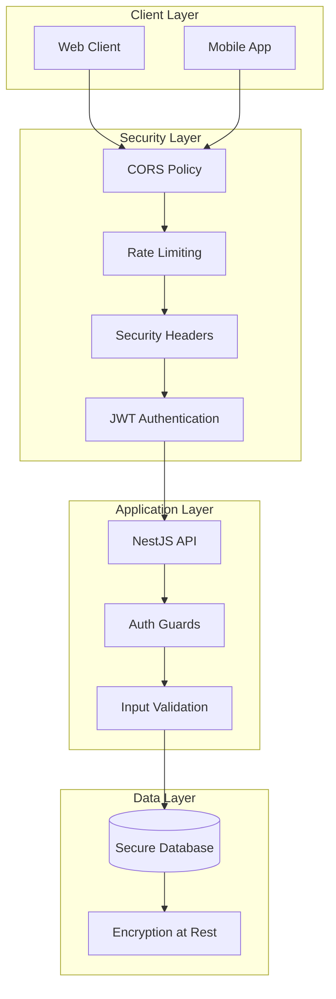

# 🔒 EcoRide Security Guide

## Security Overview

EcoRide implements comprehensive security measures to protect user data, prevent unauthorized access, and ensure secure communication. This guide covers all security aspects of the application.

## Security Architecture



## Authentication & Authorization

### JWT Token Security

#### Token Configuration

```typescript
// jwt.config.ts
export const jwtConfig = {
  secret: process.env.JWT_SECRET, // 256-bit secret
  signOptions: {
    expiresIn: '24h',
    issuer: 'ecoride-api',
    audience: 'ecoride-client',
    algorithm: 'HS256',
  },
  verifyOptions: {
    issuer: 'ecoride-api',
    audience: 'ecoride-client',
    ignoreExpiration: false,
    clockTolerance: 0,
  },
};
```

#### Token Structure

```typescript
// JWT Payload
interface JwtPayload {
  sub: number;        // User ID
  email: string;      // User email
  pseudo: string;     // Username
  role: UserRole;     // User role
  userType: UserType; // User type
  iat: number;        // Issued at
  exp: number;        // Expires at
  iss: string;        // Issuer
  aud: string;        // Audience
}
```

#### Secure Token Handling

```typescript
// auth.service.ts
@Injectable()
export class AuthService {
  private generateToken(user: User): string {
    const payload: JwtPayload = {
      sub: user.id,
      email: user.email,
      pseudo: user.pseudo,
      role: user.role,
      userType: user.userType,
    };
    
    return this.jwtService.sign(payload, {
      secret: this.configService.get('JWT_SECRET'),
      expiresIn: '24h',
      issuer: 'ecoride-api',
      audience: 'ecoride-client',
    });
  }

  async validateToken(token: string): Promise<UserWithoutPassword | null> {
    try {
      const payload = this.jwtService.verify(token, {
        secret: this.configService.get('JWT_SECRET'),
        issuer: 'ecoride-api',
        audience: 'ecoride-client',
      });
      
      // Additional validation can be added here
      return await this.getUserFromPayload(payload);
    } catch (error) {
      this.logger.warn(`Invalid token: ${error.message}`);
      return null;
    }
  }
}
```

### Password Security

#### Password Hashing

```typescript
// password.service.ts
import * as bcrypt from 'bcryptjs';

@Injectable()
export class PasswordService {
  private readonly saltRounds = 12;

  async hashPassword(password: string): Promise<string> {
    const salt = await bcrypt.genSalt(this.saltRounds);
    return bcrypt.hash(password, salt);
  }

  async comparePassword(password: string, hash: string): Promise<boolean> {
    return bcrypt.compare(password, hash);
  }

  validatePasswordStrength(password: string): boolean {
    const passwordRegex = /^(?=.*[a-z])(?=.*[A-Z])(?=.*\d)(?=.*[@$!%*?&])[A-Za-z\d@$!%*?&]{8,}$/;
    return passwordRegex.test(password);
  }
}
```

#### Password Validation DTO

```typescript
// password-validation.dto.ts
import { IsString, MinLength, Matches } from 'class-validator';

export class PasswordDto {
  @IsString()
  @MinLength(8, { message: 'Password must be at least 8 characters long' })
  @Matches(/^(?=.*[a-z])(?=.*[A-Z])(?=.*\d)(?=.*[@$!%*?&])[A-Za-z\d@$!%*?&]{8,}$/, {
    message: 'Password must contain at least one uppercase letter, one lowercase letter, one number, and one special character',
  })
  password: string;
}
```

### Role-Based Access Control (RBAC)

#### Permission Matrix

| Resource | VISITOR | USER | EMPLOYEE | ADMINISTRATOR |
|----------|---------|------|----------|---------------|
| View Public Trips | ✅ | ✅ | ✅ | ✅ |
| Register/Login | ✅ | ✅ | ✅ | ✅ |
| Book Trips | ❌ | ✅ | ✅ | ✅ |
| Create Trips | ❌ | ✅ | ✅ | ✅ |
| Manage Own Profile | ❌ | ✅ | ✅ | ✅ |
| Moderate Reviews | ❌ | ❌ | ✅ | ✅ |
| View All Users | ❌ | ❌ | ✅ | ✅ |
| Manage Users | ❌ | ❌ | ❌ | ✅ |
| System Configuration | ❌ | ❌ | ❌ | ✅ |

#### Role Guards Implementation

```typescript
// roles.guard.ts
@Injectable()
export class RolesGuard implements CanActivate {
  constructor(private reflector: Reflector) {}

  canActivate(context: ExecutionContext): boolean {
    const requiredRoles = this.reflector.getAllAndOverride<UserRole[]>(
      ROLES_KEY,
      [context.getHandler(), context.getClass()],
    );

    if (!requiredRoles) {
      return true;
    }

    const { user } = context.switchToHttp().getRequest();
    return requiredRoles.some((role) => user.role === role);
  }
}

// Resource ownership guard
@Injectable()
export class ResourceOwnershipGuard implements CanActivate {
  constructor(
    private reflector: Reflector,
    private usersService: UsersService,
  ) {}

  async canActivate(context: ExecutionContext): Promise<boolean> {
    const request = context.switchToHttp().getRequest();
    const user = request.user;
    const resourceId = request.params.id;
    const resourceType = this.reflector.get<string>('resource', context.getHandler());

    return this.checkOwnership(user.id, resourceId, resourceType);
  }

  private async checkOwnership(userId: number, resourceId: number, resourceType: string): Promise<boolean> {
    switch (resourceType) {
      case 'booking':
        return this.checkBookingOwnership(userId, resourceId);
      case 'car':
        return this.checkCarOwnership(userId, resourceId);
      default:
        return false;
    }
  }
}
```

## Input Validation & Sanitization

### Request Validation

```typescript
// Global validation pipe configuration
app.useGlobalPipes(
  new ValidationPipe({
    whitelist: true,           // Strip unknown properties
    forbidNonWhitelisted: true, // Throw error for unknown properties
    transform: true,           // Transform payloads to DTO instances
    disableErrorMessages: process.env.NODE_ENV === 'production',
    validationError: {
      target: false,           // Don't expose the target object
      value: false,            // Don't expose the validated value
    },
  }),
);
```

### Custom Validation Decorators

```typescript
// custom-validators.ts
import { registerDecorator, ValidationOptions, ValidationArguments } from 'class-validator';

export function IsValidLicensePlate(validationOptions?: ValidationOptions) {
  return function (object: any, propertyName: string) {
    registerDecorator({
      name: 'isValidLicensePlate',
      target: object.constructor,
      propertyName: propertyName,
      options: validationOptions,
      validator: {
        validate(value: any, args: ValidationArguments) {
          const licensePlateRegex = /^[A-Z]{2}-[0-9]{3}-[A-Z]{2}$/;
          return typeof value === 'string' && licensePlateRegex.test(value);
        },
        defaultMessage(args: ValidationArguments) {
          return 'License plate must be in format: XX-123-XX';
        },
      },
    });
  };
}

export function IsSecureEmail(validationOptions?: ValidationOptions) {
  return function (object: any, propertyName: string) {
    registerDecorator({
      name: 'isSecureEmail',
      target: object.constructor,
      propertyName: propertyName,
      options: validationOptions,
      validator: {
        validate(value: any, args: ValidationArguments) {
          if (typeof value !== 'string') return false;
          
          // Check for email injection patterns
          const maliciousPatterns = [
            /[<>]/,           // HTML tags
            /javascript:/i,   // JavaScript protocol
            /on\w+=/i,        // Event handlers
            /['\";]/,         // SQL injection characters
          ];
          
          return !maliciousPatterns.some(pattern => pattern.test(value));
        },
        defaultMessage() {
          return 'Email contains potentially malicious content';
        },
      },
    });
  };
}
```

### Sanitization Middleware

```typescript
// sanitization.middleware.ts
import { Injectable, NestMiddleware } from '@nestjs/common';
import { Request, Response, NextFunction } from 'express';
import * as mongoSanitize from 'express-mongo-sanitize';
import * as xss from 'xss';

@Injectable()
export class SanitizationMiddleware implements NestMiddleware {
  use(req: Request, res: Response, next: NextFunction) {
    // NoSQL injection protection
    mongoSanitize.sanitize(req.body);
    mongoSanitize.sanitize(req.query);
    mongoSanitize.sanitize(req.params);

    // XSS protection
    if (req.body) {
      req.body = this.sanitizeObject(req.body);
    }

    next();
  }

  private sanitizeObject(obj: any): any {
    if (typeof obj === 'string') {
      return xss(obj, {
        whiteList: {}, // Allow no HTML tags
        stripIgnoreTag: true,
        stripIgnoreTagBody: ['script'],
      });
    }

    if (Array.isArray(obj)) {
      return obj.map(item => this.sanitizeObject(item));
    }

    if (obj && typeof obj === 'object') {
      const sanitized: any = {};
      for (const key in obj) {
        sanitized[key] = this.sanitizeObject(obj[key]);
      }
      return sanitized;
    }

    return obj;
  }
}
```

## Database Security

### Secure Database Configuration

```typescript
// database.config.ts
export const databaseConfig = {
  type: 'mysql',
  host: process.env.DB_HOST,
  port: parseInt(process.env.DB_PORT) || 3306,
  username: process.env.DB_USERNAME,
  password: process.env.DB_PASSWORD,
  database: process.env.DB_DATABASE,
  ssl: process.env.NODE_ENV === 'production' ? {
    rejectUnauthorized: true,
    ca: fs.readFileSync(process.env.DB_SSL_CA),
    cert: fs.readFileSync(process.env.DB_SSL_CERT),
    key: fs.readFileSync(process.env.DB_SSL_KEY),
  } : false,
  extra: {
    connectionLimit: 10,
    acquireConnectionTimeout: 60000,
    timeout: 60000,
    reconnect: true,
    charset: 'utf8mb4',
  },
  logging: process.env.NODE_ENV === 'development',
  synchronize: false, // Never use in production
  migrationsRun: true,
  migrations: ['dist/migrations/*.js'],
};
```

### Query Security

```typescript
// Parameterized queries to prevent SQL injection
@Injectable()
export class BookingService {
  async findBookingsByUser(userId: number, filters: BookingFilters): Promise<Booking[]> {
    const queryBuilder = this.bookingRepository
      .createQueryBuilder('booking')
      .leftJoinAndSelect('booking.codriving', 'codriving')
      .where('booking.passengerId = :userId', { userId });

    // Safe parameter binding
    if (filters.status) {
      queryBuilder.andWhere('booking.status = :status', { status: filters.status });
    }

    if (filters.startDate) {
      queryBuilder.andWhere('codriving.startDate >= :startDate', { 
        startDate: filters.startDate 
      });
    }

    return queryBuilder.getMany();
  }

  // Avoid raw queries, but if necessary, use parameterization
  async getBookingStats(userId: number): Promise<any> {
    return this.bookingRepository.query(
      'SELECT COUNT(*) as total, AVG(creditsUsed) as avgCredits FROM bookings WHERE passengerId = ?',
      [userId]
    );
  }
}
```

### Data Encryption

```typescript
// encryption.service.ts
import * as crypto from 'crypto';

@Injectable()
export class EncryptionService {
  private readonly algorithm = 'aes-256-gcm';
  private readonly keyLength = 32;
  private readonly ivLength = 16;
  private readonly tagLength = 16;

  private getKey(): Buffer {
    return crypto.scryptSync(process.env.ENCRYPTION_KEY, 'salt', this.keyLength);
  }

  encrypt(text: string): string {
    const key = this.getKey();
    const iv = crypto.randomBytes(this.ivLength);
    const cipher = crypto.createCipher(this.algorithm, key);
    
    cipher.setAAD(Buffer.from('ecoride-encryption'));
    
    let encrypted = cipher.update(text, 'utf8', 'hex');
    encrypted += cipher.final('hex');
    
    const tag = cipher.getAuthTag();
    
    return iv.toString('hex') + ':' + tag.toString('hex') + ':' + encrypted;
  }

  decrypt(encryptedText: string): string {
    const [ivHex, tagHex, encrypted] = encryptedText.split(':');
    
    const key = this.getKey();
    const iv = Buffer.from(ivHex, 'hex');
    const tag = Buffer.from(tagHex, 'hex');
    
    const decipher = crypto.createDecipher(this.algorithm, key);
    decipher.setAAD(Buffer.from('ecoride-encryption'));
    decipher.setAuthTag(tag);
    
    let decrypted = decipher.update(encrypted, 'hex', 'utf8');
    decrypted += decipher.final('utf8');
    
    return decrypted;
  }
}
```

## Network Security

### HTTPS Configuration

```typescript
// main.ts - SSL/TLS setup
import * as fs from 'fs';
import * as https from 'https';

async function bootstrap() {
  const app = await NestFactory.create(AppModule);

  if (process.env.NODE_ENV === 'production') {
    const httpsOptions = {
      key: fs.readFileSync(process.env.SSL_KEY_PATH),
      cert: fs.readFileSync(process.env.SSL_CERT_PATH),
      // Additional security options
      secureProtocol: 'TLSv1_2_method',
      ciphers: [
        'ECDHE-RSA-AES256-GCM-SHA512',
        'DHE-RSA-AES256-GCM-SHA512',
        'ECDHE-RSA-AES256-GCM-SHA384',
        'DHE-RSA-AES256-GCM-SHA384',
      ].join(':'),
      honorCipherOrder: true,
    };

    await app.listen(3000, () => {
      console.log('HTTPS Server running on port 3000');
    });
  } else {
    await app.listen(3000);
  }
}
```

### CORS Configuration

```typescript
// cors.config.ts
export const corsConfig = {
  origin: (origin: string, callback: (error: Error | null, allow?: boolean) => void) => {
    const allowedOrigins = process.env.CORS_ORIGIN?.split(',') || [];
    
    // Allow requests with no origin (mobile apps, etc.)
    if (!origin) return callback(null, true);
    
    if (allowedOrigins.includes(origin)) {
      callback(null, true);
    } else {
      callback(new Error('Not allowed by CORS'), false);
    }
  },
  methods: ['GET', 'POST', 'PUT', 'DELETE', 'PATCH'],
  allowedHeaders: [
    'Origin',
    'X-Requested-With',
    'Content-Type',
    'Accept',
    'Authorization',
    'X-API-Key',
  ],
  credentials: true,
  maxAge: 86400, // 24 hours
  preflightContinue: false,
  optionsSuccessStatus: 204,
};
```

### Rate Limiting

```typescript
// rate-limit.config.ts
import { ThrottlerModule } from '@nestjs/throttler';

@Module({
  imports: [
    ThrottlerModule.forRootAsync({
      imports: [ConfigModule],
      inject: [ConfigService],
      useFactory: (config: ConfigService) => ({
        ttl: config.get('THROTTLE_TTL') || 60,
        limit: config.get('THROTTLE_LIMIT') || 100,
        storage: new ThrottlerStorageRedisService(redisInstance),
      }),
    }),
  ],
})
export class AppModule {}

// Custom rate limiting for sensitive endpoints
@Injectable()
export class AuthThrottleGuard extends ThrottlerGuard {
  protected getTracker(req: Record<string, any>): string {
    // Track by IP + User Agent for better security
    return `${req.ip}-${req.headers['user-agent']}`;
  }

  protected getLimit(context: ExecutionContext): number {
    const request = context.switchToHttp().getRequest();
    
    // Stricter limits for authentication endpoints
    if (request.url.includes('/auth/')) {
      return 5; // 5 requests per minute for auth
    }
    
    return super.getLimit(context);
  }
}
```

## Security Headers

### Helmet Configuration

```typescript
// security-headers.config.ts
import helmet from 'helmet';

export const helmetConfig = helmet({
  contentSecurityPolicy: {
    directives: {
      defaultSrc: ["'self'"],
      styleSrc: ["'self'", "'unsafe-inline'", 'https://fonts.googleapis.com'],
      scriptSrc: ["'self'"],
      imgSrc: ["'self'", 'data:', 'https:'],
      fontSrc: ["'self'", 'https://fonts.gstatic.com'],
      connectSrc: ["'self'"],
      frameSrc: ["'none'"],
      objectSrc: ["'none'"],
      upgradeInsecureRequests: [],
    },
  },
  hsts: {
    maxAge: 31536000, // 1 year
    includeSubDomains: true,
    preload: true,
  },
  noSniff: true,
  frameguard: { action: 'deny' },
  xssFilter: true,
  referrerPolicy: { policy: 'same-origin' },
  permittedCrossDomainPolicies: false,
});

// Custom security headers middleware
@Injectable()
export class SecurityHeadersMiddleware implements NestMiddleware {
  use(req: Request, res: Response, next: NextFunction) {
    // Custom security headers
    res.setHeader('X-API-Version', '1.0');
    res.setHeader('X-Content-Type-Options', 'nosniff');
    res.setHeader('X-Download-Options', 'noopen');
    res.setHeader('X-Frame-Options', 'DENY');
    res.setHeader('X-Permitted-Cross-Domain-Policies', 'none');
    res.setHeader('X-XSS-Protection', '1; mode=block');
    
    // Remove server information
    res.removeHeader('X-Powered-By');
    res.removeHeader('Server');
    
    next();
  }
}
```

## Monitoring & Logging

### Security Event Logging

```typescript
// security-logger.service.ts
@Injectable()
export class SecurityLoggerService {
  private readonly logger = new Logger(SecurityLoggerService.name);

  logAuthAttempt(email: string, success: boolean, ip: string, userAgent: string) {
    const logData = {
      event: 'AUTH_ATTEMPT',
      email: this.hashEmail(email),
      success,
      ip: this.hashIP(ip),
      userAgent: this.sanitizeUserAgent(userAgent),
      timestamp: new Date().toISOString(),
    };

    if (success) {
      this.logger.log(`Successful login: ${JSON.stringify(logData)}`);
    } else {
      this.logger.warn(`Failed login attempt: ${JSON.stringify(logData)}`);
    }
  }

  logSuspiciousActivity(userId: number, activity: string, details: any, ip: string) {
    const logData = {
      event: 'SUSPICIOUS_ACTIVITY',
      userId,
      activity,
      details: this.sanitizeDetails(details),
      ip: this.hashIP(ip),
      timestamp: new Date().toISOString(),
    };

    this.logger.error(`Suspicious activity detected: ${JSON.stringify(logData)}`);
  }

  logDataAccess(userId: number, resource: string, action: string) {
    const logData = {
      event: 'DATA_ACCESS',
      userId,
      resource,
      action,
      timestamp: new Date().toISOString(),
    };

    this.logger.log(`Data access: ${JSON.stringify(logData)}`);
  }

  private hashEmail(email: string): string {
    return crypto.createHash('sha256').update(email).digest('hex').substring(0, 8);
  }

  private hashIP(ip: string): string {
    return crypto.createHash('sha256').update(ip).digest('hex').substring(0, 8);
  }

  private sanitizeUserAgent(userAgent: string): string {
    // Remove potentially sensitive information
    return userAgent.replace(/\d+\.\d+\.\d+\.\d+/g, '[IP]').substring(0, 200);
  }

  private sanitizeDetails(details: any): any {
    // Remove sensitive fields
    const sanitized = { ...details };
    delete sanitized.password;
    delete sanitized.token;
    delete sanitized.secret;
    return sanitized;
  }
}
```

### Intrusion Detection

```typescript
// intrusion-detection.service.ts
@Injectable()
export class IntrusionDetectionService {
  private readonly suspiciousIPs = new Map<string, number>();
  private readonly failedAttempts = new Map<string, number>();

  constructor(private securityLogger: SecurityLoggerService) {}

  @Cron('0 */5 * * * *') // Every 5 minutes
  cleanupSuspiciousActivity() {
    const fiveMinutesAgo = Date.now() - 5 * 60 * 1000;
    
    // Reset counters older than 5 minutes
    for (const [ip, timestamp] of this.suspiciousIPs.entries()) {
      if (timestamp < fiveMinutesAgo) {
        this.suspiciousIPs.delete(ip);
      }
    }
  }

  checkSuspiciousActivity(ip: string, userAgent: string): boolean {
    // Check for rapid requests
    const attempts = this.suspiciousIPs.get(ip) || 0;
    this.suspiciousIPs.set(ip, attempts + 1);

    if (attempts > 100) { // More than 100 requests in 5 minutes
      this.securityLogger.logSuspiciousActivity(
        null,
        'RAPID_REQUESTS',
        { requestCount: attempts },
        ip
      );
      return true;
    }

    // Check for suspicious user agents
    if (this.isSuspiciousUserAgent(userAgent)) {
      this.securityLogger.logSuspiciousActivity(
        null,
        'SUSPICIOUS_USER_AGENT',
        { userAgent },
        ip
      );
      return true;
    }

    return false;
  }

  private isSuspiciousUserAgent(userAgent: string): boolean {
    const suspiciousPatterns = [
      /sqlmap/i,
      /nikto/i,
      /nessus/i,
      /burp/i,
      /nmap/i,
      /python-requests/i,
      /curl/i,
      /wget/i,
    ];

    return suspiciousPatterns.some(pattern => pattern.test(userAgent));
  }
}
```

## Security Testing

### Automated Security Tests

```typescript
// security.e2e-spec.ts
describe('Security (e2e)', () => {
  let app: INestApplication;

  beforeEach(async () => {
    const moduleFixture: TestingModule = await Test.createTestingModule({
      imports: [AppModule],
    }).compile();

    app = moduleFixture.createNestApplication();
    await app.init();
  });

  describe('SQL Injection Protection', () => {
    it('should reject SQL injection in login', () => {
      return request(app.getHttpServer())
        .post('/auth/login')
        .send({
          email: "admin@example.com'; DROP TABLE users; --",
          password: 'password',
        })
        .expect(400);
    });
  });

  describe('XSS Protection', () => {
    it('should sanitize XSS in user registration', () => {
      return request(app.getHttpServer())
        .post('/auth/register')
        .send({
          firstname: '<script>alert("xss")</script>',
          lastname: 'Doe',
          email: 'test@example.com',
          password: 'SecurePass123!',
          pseudo: 'testuser',
        })
        .expect(400);
    });
  });

  describe('Rate Limiting', () => {
    it('should rate limit authentication attempts', async () => {
      const promises = Array(10).fill(0).map(() =>
        request(app.getHttpServer())
          .post('/auth/login')
          .send({
            email: 'test@example.com',
            password: 'wrongpassword',
          })
      );

      const results = await Promise.all(promises);
      const tooManyRequests = results.filter(r => r.status === 429);
      expect(tooManyRequests.length).toBeGreaterThan(0);
    });
  });

  describe('JWT Security', () => {
    it('should reject invalid JWT tokens', () => {
      return request(app.getHttpServer())
        .get('/users/profile')
        .set('Authorization', 'Bearer invalid.jwt.token')
        .expect(401);
    });

    it('should reject expired JWT tokens', () => {
      const expiredToken = 'eyJhbGciOiJIUzI1NiIsInR5cCI6IkpXVCJ9.eyJzdWIiOjEsImV4cCI6MTYwMDAwMDAwMH0.invalid';
      
      return request(app.getHttpServer())
        .get('/users/profile')
        .set('Authorization', `Bearer ${expiredToken}`)
        .expect(401);
    });
  });
});
```

## Security Checklist

### Pre-Deployment Security Audit

- [ ] **Authentication & Authorization**
  - [ ] JWT tokens properly configured with strong secrets
  - [ ] Password hashing uses bcrypt with adequate salt rounds
  - [ ] Role-based access control implemented
  - [ ] Session management secure

- [ ] **Input Validation & Sanitization**
  - [ ] All inputs validated using DTOs
  - [ ] XSS protection enabled
  - [ ] SQL injection prevention measures
  - [ ] NoSQL injection protection

- [ ] **Network Security**
  - [ ] HTTPS enforced in production
  - [ ] CORS properly configured
  - [ ] Security headers implemented
  - [ ] Rate limiting enabled

- [ ] **Database Security**
  - [ ] Database user has minimal privileges
  - [ ] SSL/TLS enabled for database connections
  - [ ] Sensitive data encrypted at rest
  - [ ] Regular security updates applied

- [ ] **Monitoring & Logging**
  - [ ] Security events logged
  - [ ] Intrusion detection system active
  - [ ] Regular security audits scheduled
  - [ ] Incident response plan documented

- [ ] **Infrastructure Security**
  - [ ] Servers hardened and updated
  - [ ] Firewall properly configured
  - [ ] Backup encryption enabled
  - [ ] Access controls implemented

### Incident Response Plan

1. **Detection**: Monitor logs and alerts for security incidents
2. **Containment**: Isolate affected systems immediately
3. **Assessment**: Determine scope and impact of the incident
4. **Eradication**: Remove threats and patch vulnerabilities
5. **Recovery**: Restore systems and monitor for issues
6. **Lessons Learned**: Document and improve security measures

This comprehensive security guide ensures EcoRide maintains the highest security standards to protect user data and system integrity.
